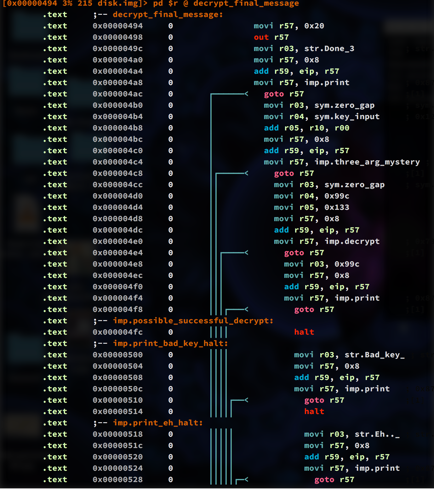
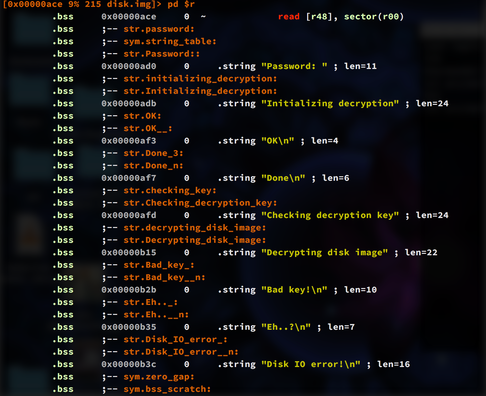

###  A Reverse Engineering Puzzle

So a while ago on a few reverse engineering sites, this image appeared that was supposedly a scan from a Danish
newspaper.  On one side is a tiny (incomplete) VM written in x86 assembly, and the other side seems to be
a url-encoded blob of binary.

Some people were saying it was some kind of test the Danish intelligence community decided to throw into the
paper as a puzzle to recruit.  I'm not Danish, so that part wasn't very interesting to me, and it was waaay
less interesting to me to try and type all that url-encoded crap into a file, until someone noticed that
there were bolded letters that spelled out the address of a TOR site that just had the encoded blob in a file.

Here's a good quality image of the puzzle as it was given.


So notice how the blob is formatted with a big question mark in the middle.  The file from the TOR site actually
had a bunch of shell escape sequences that colored, bolded, and arranged the text into the same shape as printed.

So, if you were to `cat` this to your screen, (which I didn't cause untrustworthy escape sequences), it would have
drawn it just like the print.  I wrote a little throw-away script to remove those escapes and decode it into
a file I've provided in this repo `disk.img`.


###  Trusting the provided VM

Call me paranoid, but I thought it wasn't best to assemble the provided VM and have it run some random code I found
on TOR.  Random thoughts I was having were VM escapes and stuff, because I have no idea what that binary does.

Since the VM was not even complete, it was missing about half the Opcodes with the intention that you would fill
them in yourself, and since I would have no debugger or analyser to check it out, and since I <3 radare2, I just
decided to write some plugins for `r2` that could run the binary in radare2's ESIL VM, and perform analysis for me.

So, that's what this is.  It's a pretty cute binary in some ways, and was fun to reverse, at least until it reached
the limits of how much I know about encryption :)

I really had no idea what to call this binary format, it's Danish I guess, it's 32-bit, so I named it dan32.

If anything, hey, here is an example of how to to write a binary, disassembler, and analyser for radare2 in C.





###  What the binary does

Some of the first things the binary does, is checks that you are actually interpreting it in the proper endian.
By default you might interpret it in little-endian, but it happens to be big-endian.  Running it in little-endian
does a cute trick where the first 32-bit instruction, when read backwards is a useless immediate move that acts
like a no-op, and after that sends you to a routine that prints out an endian error.

Another tests it performs on itself, is trashing some of its memory, and then immediately using the `read`
instruction to correct it back the way it was.  If this doesn't work you get a disk read error.

The last self test it does is, while in a loop, tests that `0 / -1 == 0`, and then uses that zero in a calculation,
if that fails we get an ALU error.

I decided to do the memory layout like this:

```
00  0x00000000 |#------------------------------| 0x0000092b  2.3K mrwx .text
01  0x0000092c |#------------------------------| 0x00000b79   589 mrw- .bss
02  0x00000c00 |----##-------------------------| 0x00007503 26.3K mrw- .encrypted
03  0x000ffc00 |--------------##---------------| 0x00100000    1K mrw- .stack
04* 0x00200000 |-----------------------------##| 0x00207503 29.3K mr-- .diskrom
=>  0x00200000 |-------------------------------| 0x00200100
```



The first bit of the binary loads the .diskrom section into the .text area to run, the .bss section has some initialized and
global working data, and at `0xc00` there is an encrypted blob.

The binary asks you for a passphrase, does some keystretching on it in the .bss section, and then tries to decrypt a known
ciphertext.  If that decrypts ok, it proceeds to decrypt the .encrypted section.  What happens after that, is a mystery for me
so far.  I am by no means that great at cryptography, but I'm assuming there are faults with it.  

Some random faults I think I may notice are that the keystretching takes place in an area of memory that is initialized with
some zero bytes, followed by bytes counting from 1 to 256.  A process then stretches the key using the contents of this area of memory.

Another thing I notice, is that the decryption takes place in blocks of 512 bytes, while the stretched key is only 256 bytes, which
probably constitues key reuse.

One last interesting thing about the opcode set, is that it only supplies bitwise NOR, and it recreates XOR by chaining NORs, particularly
in the decryption routine, which is originally how I spotted that routine.

###  The Patch

You can apply the supplied patch file to radare2 and recompile to add dan32 support.  I tried to make a standalone plugin, by copying
some of the methods in the radare2-extras repository, but radare didn't seem to pick them up.  The patch will just add them into
the current radare2 source tree.


