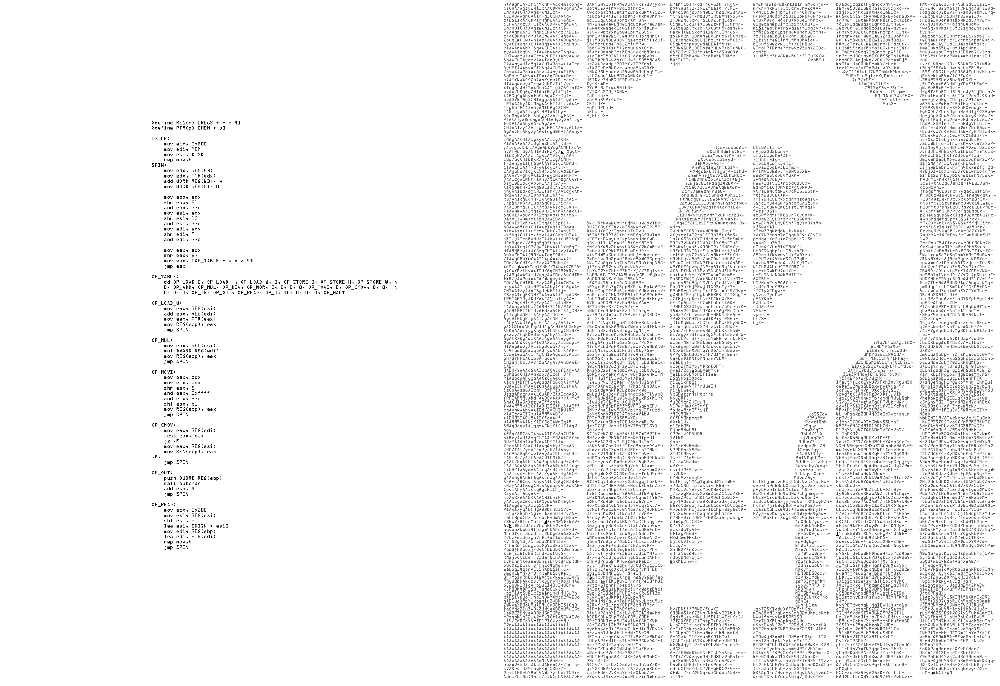

###  A Reverse Engineering Puzzle

So a while ago on a few reverse engineering sites, this image appeared that was supposedly a scan from a Danish
newspaper.  On one side is a tiny (incomplete) VM written in x86 assembly, and the other side seems to be
a url-encoded blob of binary.

Some people were saying it was some kind of test the Danish intelligence community decided to throw into the
paper as a puzzle to recruit.  I'm not Danish, so that part wasn't very interesting to me, and it was waaay
less interesting to me to try and type all that url-encoded crap into a file, until someone noticed that
there were bolded letters that spelled out the address of a TOR site that just had the encoded blob in a file.

Here's a good quality image of the puzzle as it was given.

###  A Detailed Writeup

I solved this puzzle recently, and did an in-depth write up of it, that can be found here:

https://safiire.github.io/blog/2017/08/19/solving-danish-defense-intelligence-puzzle/

###  Standalone Plugins
These come in the form of a patch to the Radare2 master branch, however I should be able to separate them
and have them compile separately from radare itself.  I will update these, and perhaps get them included
in radare-extras repo, or so they can be installed with radare's package manager.

